# Reproduce the results of the article 
# **Relationship of gender differences in preferences to economic development and gender equality**

## Introduction

This study reproduces the results of the article [Relationship of gender differences in preferences to economic development and gender equality](https://science.sciencemag.org/content/362/6412/eaas9899.full) (DOI: 10.1126/science.aas9899) and partially its [supplementary material](https://science.sciencemag.org/content/sci/suppl/2018/10/17/362.6412.eaas9899.DC1/aas9899_Falk_SM.pdf).

The following two relevant papers have to be also cited in all publications that make use of or refer in any kind to GPS dataset:

- Falk, A., Becker, A., Dohmen, T., Enke, B., Huffman, D., & Sunde, U. (2018). [Global evidence on economic preferences.](https://doi.org/10.1093/qje/qjy013) *Quarterly Journal of Economics*, 133 (4), 1645–1692.

- Falk, A., Becker, A., Dohmen, T. J., Huffman, D., & Sunde, U. (2016). The preference survey module: A validated instrument for measuring risk, time, and social preferences. IZA Discussion Paper No. 9674.

Below we describe how we collected, clean and standardized the the data, as well the the whole analysis pipeline. The output files allow the reader to reproduce the figures directly, bypassing the pipeline. For more details, especially on the background study and the meaning of the variables, refer to the main paper.

## Preparation of the data

### Data Collection, Cleaning, and Standardization

The data used by the authors is not fully available because of two reasons:

1. **Data paywall:** Some part of the data is not available for free. It requires to pay a fee to the Gallup to access them. This is the case for the additional dataset that is used in the article, for instance, the one that contains the education level and the household income quintile. Check the website of the [briq - Institute on Behavior & Inequality](https://www.briq-institute.org/global-preferences/home) for more information on it. 

2. **Data used in study is not available online:** This is what happened for the LogGDP p/c calculated in 2005 US dollars (which is not directly available online). We decided to calculate the LogGDP p/c in 2010 US dollars because it was easily available, which should not change the main findings of the article. 

The procedure for cleaning is described for each dataset, in the corresponding section below. After manually cleaning the dataset, we standardized the names of the countries and merged the datasets into one within the function [PrepareData.r](https://github.com/scerioli/Global_Preferences_Survey/blob/master/functions/PrepareData.r).


#### Global Preferences Survey

This data is protected by copyright and can't be given to third parties.

To download the GPS dataset, go to the website of the Global Preferences Survey in the section "downloads". There, choose the "Dataset" form and after filling it, we can download the dataset. 

*Hint: The organisation can be also "private".*


#### GDP per capita

From the [website of the World Bank](https://data.worldbank.org/indicator/), one can access the data about the GDP per capita on a certain set of years. We took the GDP per capita (constant 2010 US$), made an average of the data from 2003 until 2012 for all the available countries, and matched the names of the countries with the ones from the GPS dataset.


#### Gender Equality Index

The Gender Equality Index is composed of four main datasets.

- **Time since women’s suffrage:** Taken from the [Inter-Parliamentary Union Website](http://www.ipu.org/wmn-e/suffrage.htm#Note1). We prepared the data in the following way. For several countries more than one date where provided (for example, the right to be elected and the right to vote). We use the last date when both vote and stand for election right were granted, with no other restrictions commented. Some counties were a colony or within union of the countries (for instance, Kazakhstan in Soviet Union). For these countries, the rights to vote and be elected might be technically granted two times within union and as independent state. In this case we kept the first date. It was difficult to decide on South Africa because its history shows the racism part very entangled with women's rights. We kept the latest date when also Black women could vote. For Nigeria, considered the distinctions between North and South, we decided to keep only the North data because, again, it was showing the completeness of the country and it was the last date. Note: USA data doesn't take into account that also up to 1964 black women couldn't vote (in general, Blacks couldn't vote up to that year). We didn’t keep this date, because it was not explicitly mentioned in the original dataset. This is in contrast with other choices made, but it is important to reproduce exactly the results of the publication, and the USA is often easy to spot on the plots.

- **UN Gender Inequality Index:** Taken from the [Human Development Report 2015](http://hdr.undp.org/sites/default/files/hdr_2016_statistical_annex.pdf). We kept only the table called "Gender Inequality Index".

- **WEF Global Gender Gap:** WEF Global Gender Gap Index Taken from the [World Economic Forum Global Gender Gap Report 2015](http://reports.weforum.org/). For countries where data were missing, data was added from the World Economic Forum Global Gender Gap Report 2006. We modified some of the country names directly on the csv file, that is why we provide this as an input file.

- **Ratio of female and male labour force participation:** Average International Labour Organization estimates from 2003 to 2012 taken from the World Bank database (http://data.worldbank.org/indicator/SL.TLF.CACT.FM.ZS). Values were inverted to create an index of equality. We took the years the avarage for the period between 2004 and 2013.


### About Missing Data

#### Main issue

During the reproduction of the article, we found that the authors didn't write in ditails how they handled missing data in the indicators.

They mention on page 14 of the Supplementary Material, that (quoting): "For countries where data were missing data were added from the World Economic Forum Global Gender Gap Report 2006 (http://www3.weforum.org/docs/WEF_GenderGap_Report_2006.pdf)."

However, there are two problems here:

- regarding the year when women received the right to vote in a specific country. The missing values here are the ones coming from the United Arab Emirates and Saudi Arabia, that neither in 2006 (when the WEF Global Gender Gap Report that the authors quote as a reference for the missing values) nor now (in 2021) have guaranteed yet the right to vote for women.

- there are missing data also in the other sources that the authors quote. So a quick search for the missing countries of the WEF report of 2015, shows us that these countries can’t be found in the report of 2006 either. 

These two unclear points, even though in our understanding not crucial for the replication of the analysis, are not desirable. 

#### Dealing with the missing values

What one can do when dealing with missing values is a matter of debate and of taste. As a first approach, we simply excluded them. In a second step, we tried to use some algorithm for the imputation of the missing values.

##### Cut the NAs

As a firts step of the reproduction analysis, the Principal Component Analysis (PCA) has been performed only on the complete dataset, leading to a cut of 7 countries from the initial dataset for different missing values:

- For the **time since women’s suffrage**:

  - United Arab Emirates

  - Saudi Arabia

- For the **WEF Global Gender Gap Index**:

  - Afghanistan

  - Bosnia Herzegovina

  - Haiti

  - Iraq

- For the **UN Gender Inequality Index**:

  - Nigeria

This cut our dataset from 76 countries to 69, meaning a 10% less of the initial dataset. As 10% is small enough not to have a strong influence on the result, still to estimate how missing values influes the results, we compared different strateges for inputation of the missing values. 

##### Imputing NAs: the ````missMDA```` library

With a small research on the web, we could find several proposed solutions for the imputation of NAs with the scope of performing a PCA in *R*. One of these was to install the ```missMDA``` package and use the ```imputePCA``` function on the data we needed to fill.

This function works very nicely: one first selects the columns of the data where there are missing values, then passes it to the function, and then runs the PCA on the sublist called completeObs generated from this function. The result is a list of four columns that are exactly the input data but with the missing values that have been filled with imputed values.

There is just one thing to watch out: the data must be numeric.


## Research Article

Here a quick explanation of the methods used to perform the analysis on the data and some further information about the creation of the plots.

### Creation of the Models

#### Linear Model on Each Country for Each Preference

Starting from the complete dataset (meaning with removed NA rows), we wanted to reproduce the data plotted in Fig. S2. regarding the gender differences and economic development by preference and by country.

As already mentioned in the previous paragraph, part of the data to reproduce the article is missing and it can be accessed only after payment of a subscription fee to the Gallup World Poll. We decided, therefore, to continue the analysis without using two of the variables used in the model (education level and household income quintile).

We created a linear model for each country using an expression from the article, omitting the 2 missing variables:

```preference ~ gender + age + age_2 + subj_math_skills ```

This resulted in 6 different models (one for each preference measure), having intercept and 4 weights, each of the weight being related to the variable in the formula above. The weight for the dummy variable "gender" is used as a measure of the country-level gender difference. Therefore, in total, we have 6 weights that represent the preference difference related to the gender for 76 countries.

We plotted the logarithm of the average GDP per capita versus the preference differences, for the 6 different preference measurements. When plotting this, we used a linear model to fit and extract the correlation and the p-value.


## Principal Component Analysis

To summarise the average gender difference among these preferences, we performed a principal component analysis on the gender preference differences from the linear model and used the first component as a summary index of average gender differences in preferences. 

We then performed a linear regression on the data points, extracting the correlation and p-value of the average gender difference in preferences versus the logarithm of the average GDP per capita. The variables on y-axis were additionally transformed as (y-y_min)/(y_max-y_min) (see Fig. 1B).

We performed a PCA also on the four datasets used for Gender Equality, to extract a more general Gender Equality Index based on them. We then used this Gender-Equality Index for plotting the same average gender differences as a function of this index, performing a linear regression to calculate the p-value and the correlation value (see Fig. 1D). Note that here also the Gender Equality Index is transformed to be on a scale between 0 and 1.


### Variable Conditioning

For the plots in Fig. 2, a conditional analysis was performed. To plot the variables x and y residualised using the variable z:

1. We performed a linear regression of x on z, and then a linear regression of y on z.

2. We calculated the residuals of the variable x, meaning that we take the points on the x-axis and calculate the difference between these and the projection of these points on the model created from the linear regression of x on z; the same for y.

3. We plot the residuals on the corresponding axis.

This has been done for the economic development, for the Gender Equality Index, and for each of the four indicators building the Gender Equality Index. The variable used on the y-axis is, therefore, the first Principal Component of the PCA made on the gender differences on the six preferences.


### Additional about the plots

- Any variable called "Std" is standardized using the min-max method.

- Average Gender Difference (Index) is the variable extracted from the first component of the PCA performed on the gender coefficients of the six preferences, for each country.

- Gender Equality Index is the variable extracted from the first component of the PCA performed on the four indicators building this index (WEF Global Gender Gap, UN Gender Inequality Index, Ratio Female to Male LFP, and Time since Women’s Suffrage). 

- The indicators UN Gender Inequality Index and Time since Women’s Suffrage must be inverted to obtain the plots below, because their values suggest an inequality, while the index is measuring the equality.

- The preferences marked with a (–), that are patience, negative reciprocity, and risk-taking, show an inverted trend with respect to the others. To plot them, we inverted manually their values (for instance, in the histograms we multiply the mean value of the resulting quantile by a -1 factor for the above-mentioned preferences).

- The plots showing residuals in the main article are using the log GDP p/c and the Gender Equality Index after standardization, while in the supplementary material they are not standardized.


### Plots

#### Fig. 1. Analysis of gender differences in preferences in relation to economic development and gender equality

**(A)**  Mean country-level gender difference in altruism, trust, positive reciprocity, negative reciprocity, risk-taking, and patience by development level. Countries were sorted into four bins according to their GDP per capita quartile. The symbols + and − in the panel titles indicate the sign of the difference for each preference; + indicates that positive differences


**(B)** Relationship between the aggregate index of gender differences in all six preferences and log GDP per capita.

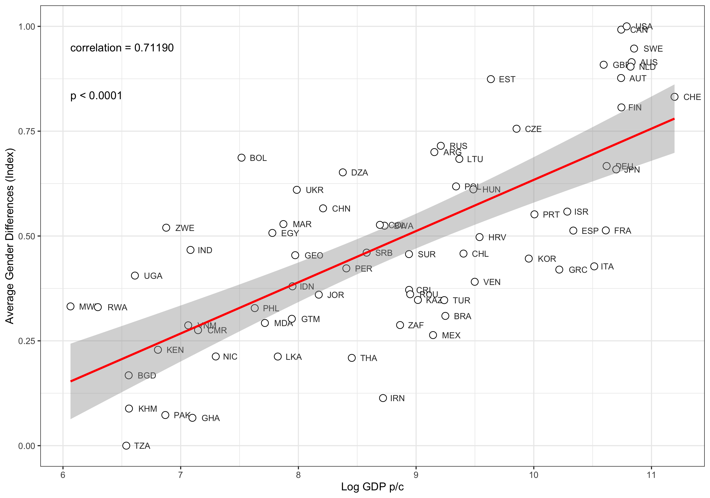

**(C)** and

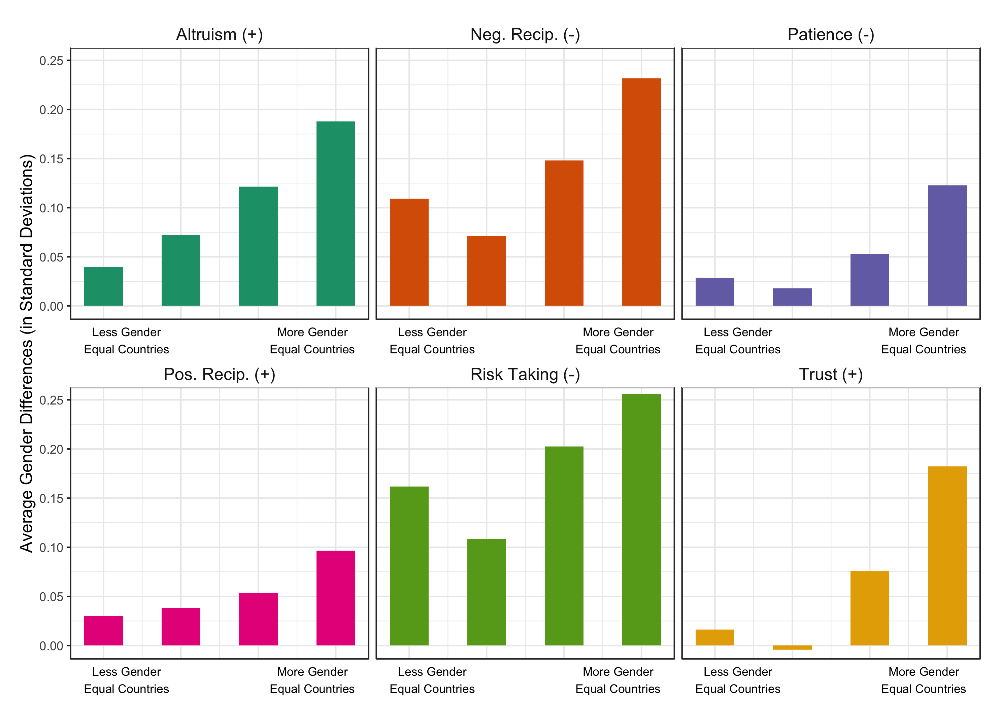

**(D)** Same relationships as in (A) and (B) for the Gender Equality Index.

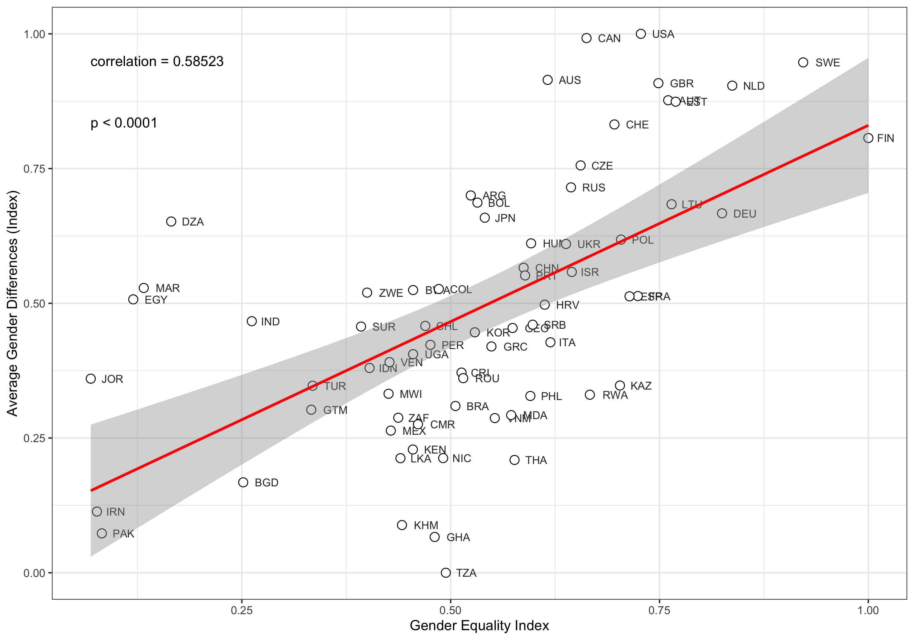

---

#### Fig. 2. Analysis of gender differences in preferences in relation to economic development conditional on gender equality, and vice versa.

**(A)** Relationship between the aggregate index of gender differences in preferences and log GDP per capita after residualizing both variables with respect to the Gender Equality Index.


**(B)** to **(F)** Relationship between the aggregate index of gender differences in preferences and five indices of gender equality after residualizing all variables with respect to log GDP per capita. Indices of gender equality are 

**(B)** the Gender Equality Index, 

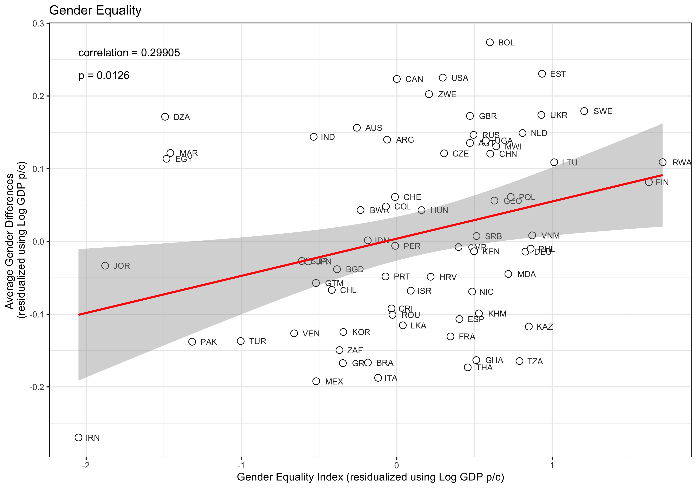

**(C)** WEF Global Gender Gap Index,

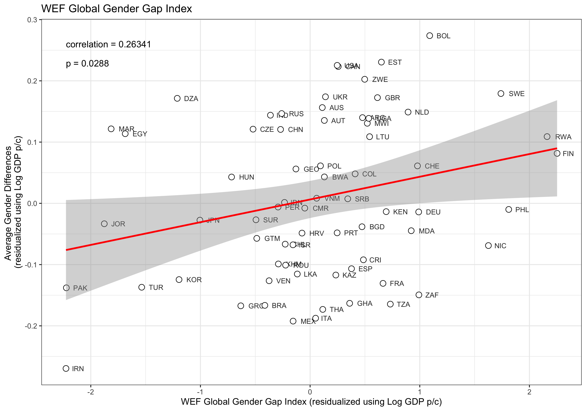

**(D)** UN Gender Equality Index, 

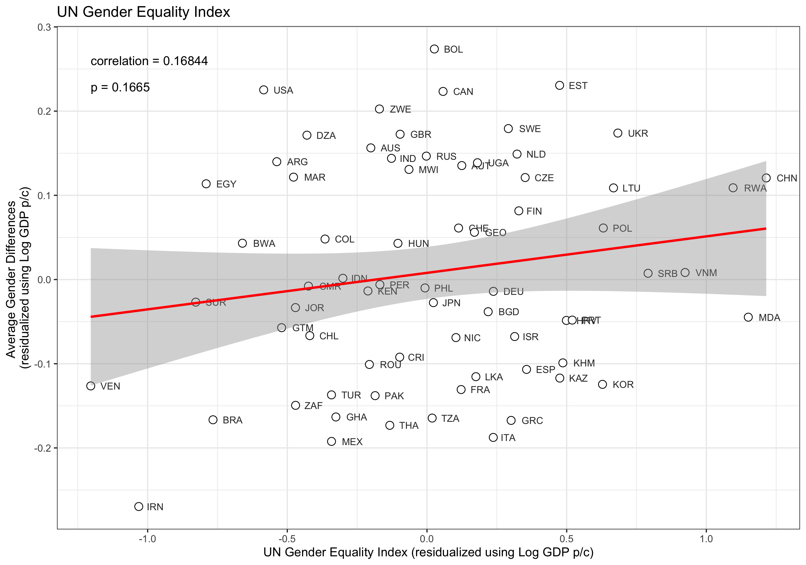

**(E)** ratio of female to male labor force participation, and 

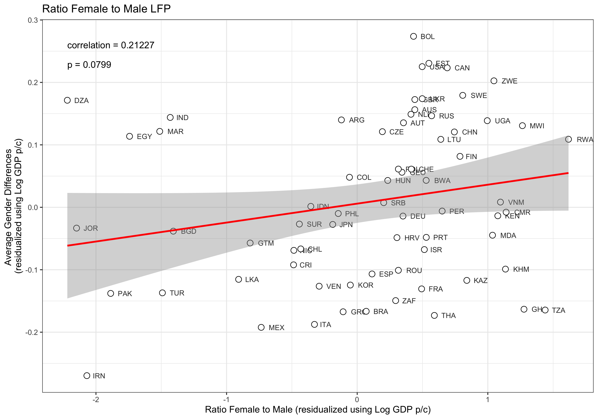

**(F)** years since women’s suffrage.

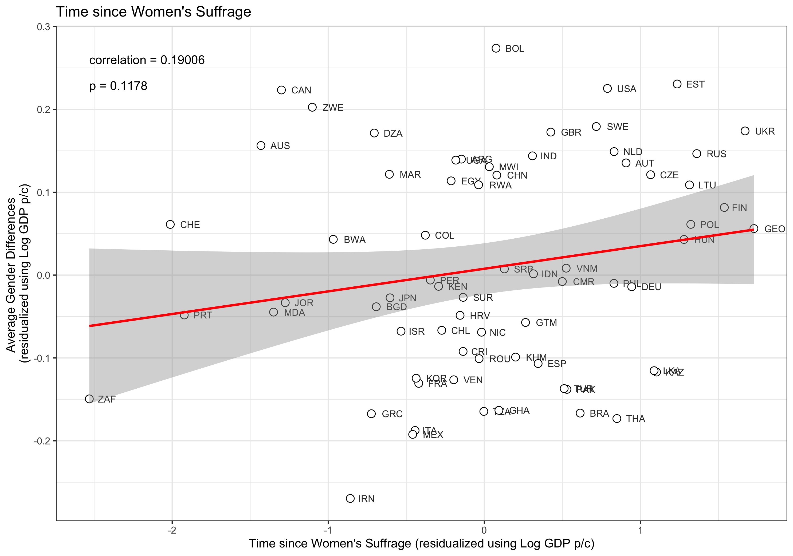

---

## Supplementary Online Material

### Variable Conditioning

For the plots in Fig. S5 and S6, we were following the same approach described above in the Main Article section regarding the Variable Conditioning.

Regarding the x-axis, we took the same variables used already in Fig. S2A (for plot S5) and S2B (for plot S6), while for the y-axis we took the gender coefficient for each country selecting for the specific preference, made a linear regression on the same z variable used to residualize the x-axis, and then the residuals.


### Preferences Standardized at Global Level

To build Fig. S8, what we have done is simply to standardize the preferences on a global level instead of at the country level. Then, the creation of the models has been done in the same way as in the main article. The plot shows the gender coefficient extracted from the model versus the log GDP per capita, for all the six preferences.


### Alternative Model

To build the alternative model without control variables, we started again from the complete dataset and created a linear model for each country using simply:

```preference ~ gender```

This resulted in 6 different models (one for each preference measure), having intercept and only 1 weight related to the gender. This weight is used as a measure of the country-level gender difference for the alternative model.

We plotted the logarithm of the average GDP per capita versus the preference differences, for the 6 different preference measurements. When plotting this, we used a linear model to fit and extract the correlation and the p-value (see Fig. S9).

### Plots

#### Fig. S2. Gender differences and economic development by preference and country. 

Each panel shows the relationship between country-level gender differences in a particular preference and the level of economic development measured by log GDP p/c, including a linear fit. For each preference, the symbols (+)/(-) in the panel titles indicate the direction of the difference. (+) indicates that women exhibited higher levels of the respective preference if the difference was positive. (-) indicates that men exhibited higher levels of the respective preference if the difference was positive. For each preference and country, the gender difference was calculated as the coefficient on a gender indicator with male as the reference category in an OLS regression of the respective preference on the gender indicator, controlling for age, age squared, subjective math skills, education level, household income quintile for the particular country sample

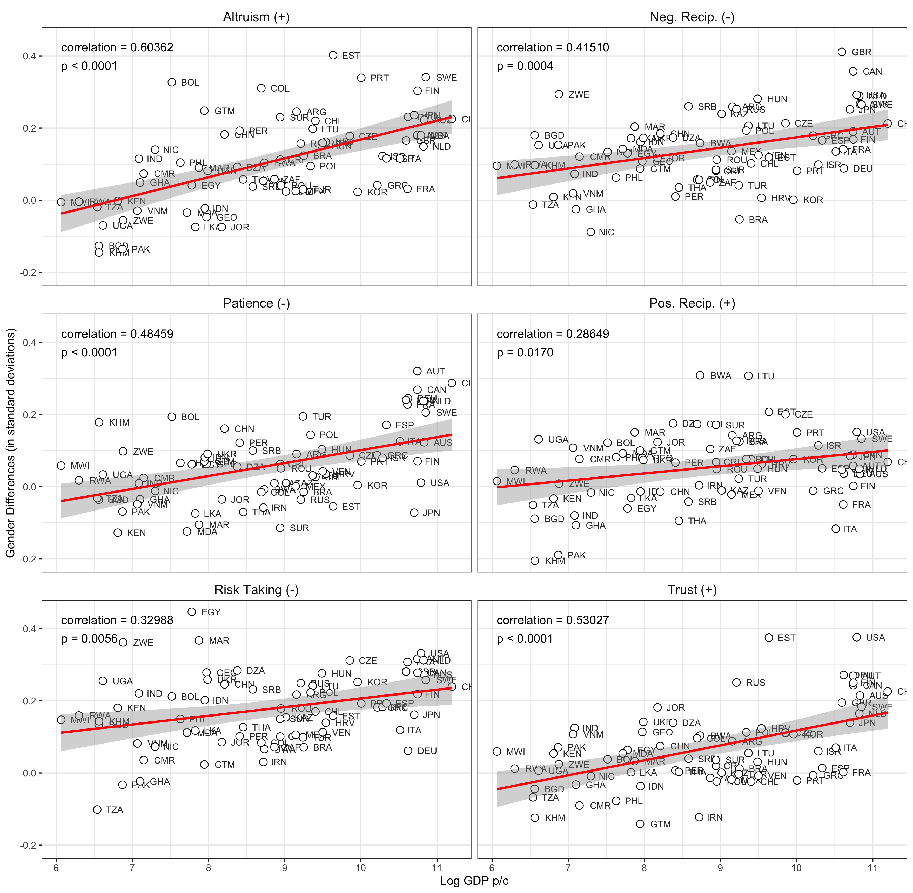

#### Fig. S3. Gender differences and gender equality by preference and country. 

Each panel shows the relationship between country-level gender differences in a particular preference and the Gender Equality Index, including a linear fit. For each preference, the symbols (+)/(-) in the panel titles indicate the direction of the difference. (+) indicates that women exhibited higher levels of the respective preference if the difference was positive. (-) indicates that men exhibited higher levels of the respective preference if the difference was positive. For each preference and country, the gender difference was calculated as the coefficient on a gender indicator with male as the reference category in an OLS regression of the respective preference on the gender indicator, controlling for age, age squared, subjective math skills, education level, household income quintile for the particular country sample.

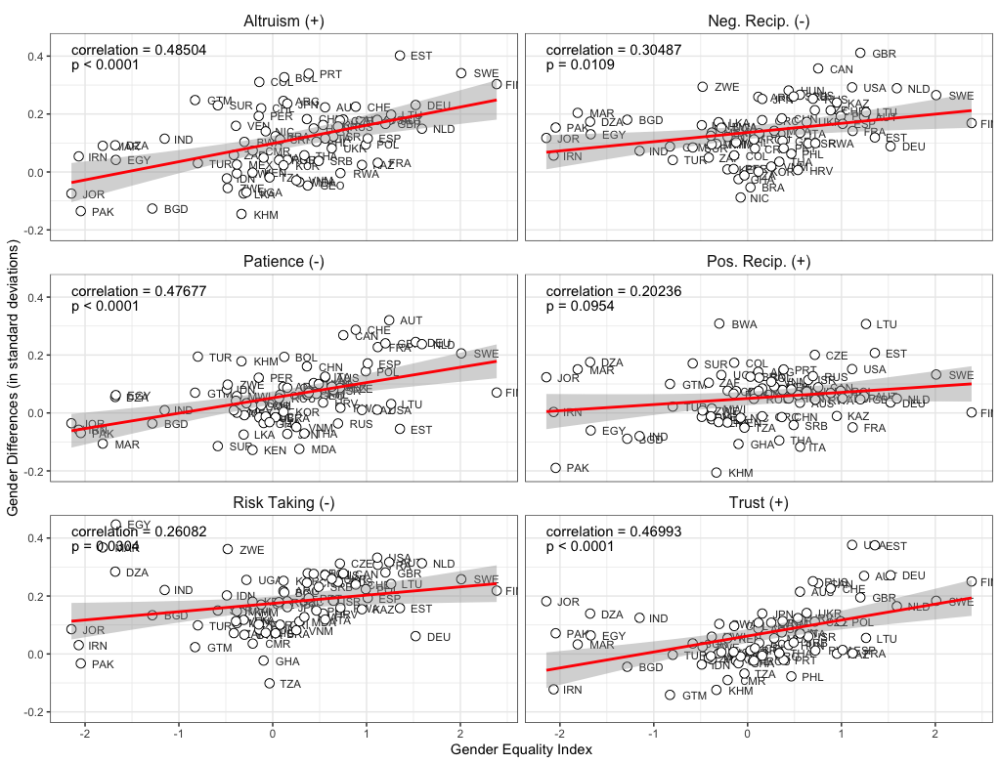

#### Fig. S4. Gender differences and gender equality by equality index. 

Each panel shows the relationship between the index of gender differences in preferences and an indicator for gender equality, including a linear fit. (A) the Global Gender Gap Index of the World Economic Forum (WEF), (B) the Gender Equality Index of the United Nations (UN), (C) the ratio of female and male labor force participation rates, and (D) years since women’s suffrage.

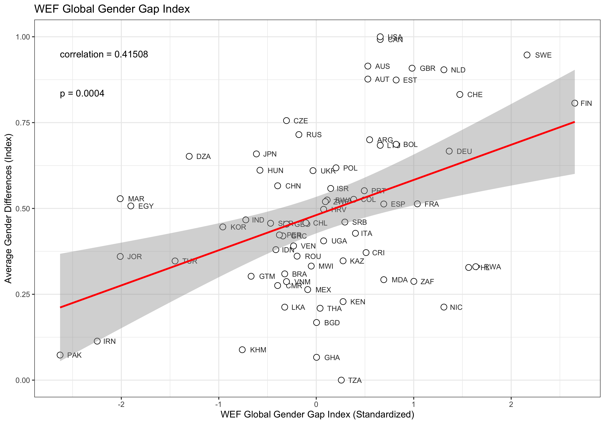 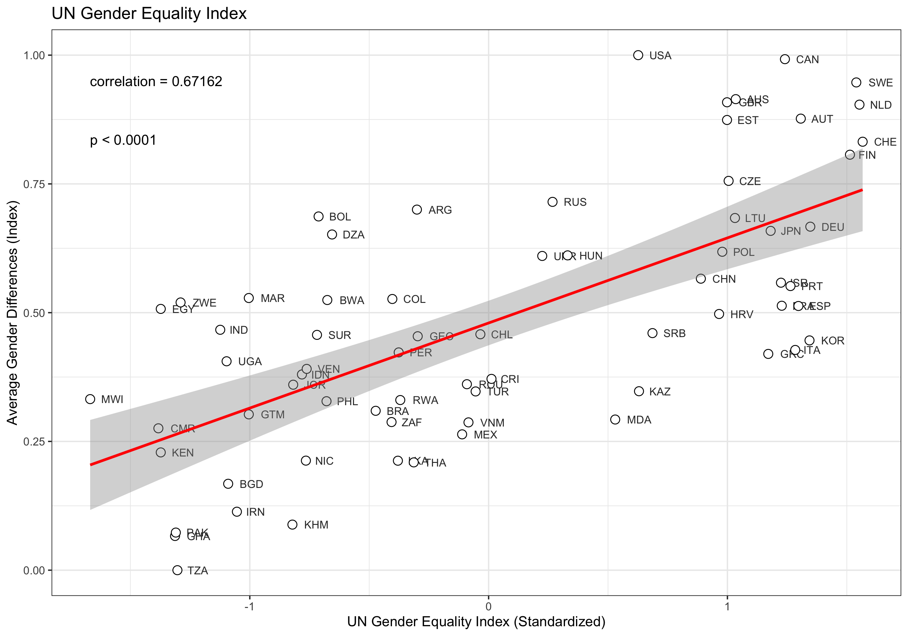

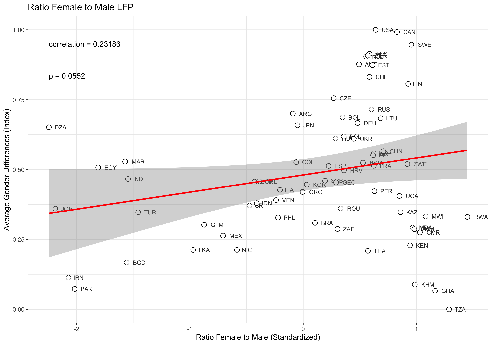 

#### Fig. S5. Gender differences and economic development conditional on gender equality by preference and country. 
Each panel shows the relationship between country-level gender differences in a particular preference and economic development measured by log GDP p/c, including a linear fit. Gender differences in preferences and log GDP p/c were residualized with respect to the Gender Equality Index. For each preference, the symbols (+)/(-) in the panel titles indicate the general direction of the difference. (+) indicates that women generally exhibited higher levels of the respective preference. (-) indicates that men generally exhibited higher levels of the respective preference. For each preference and country, the gender difference was calculated as the coefficient on a gender indicator with male as the reference category in an OLS regression of the respective preference on the gender indicator, controlling for age, age squared, subjective math skills, education level, household income quintile for the particular country sample.

**WARNING:** These plots are very different from the article's ones. We have written the authors of the article and are waiting for comparison of the methods to obtain them.

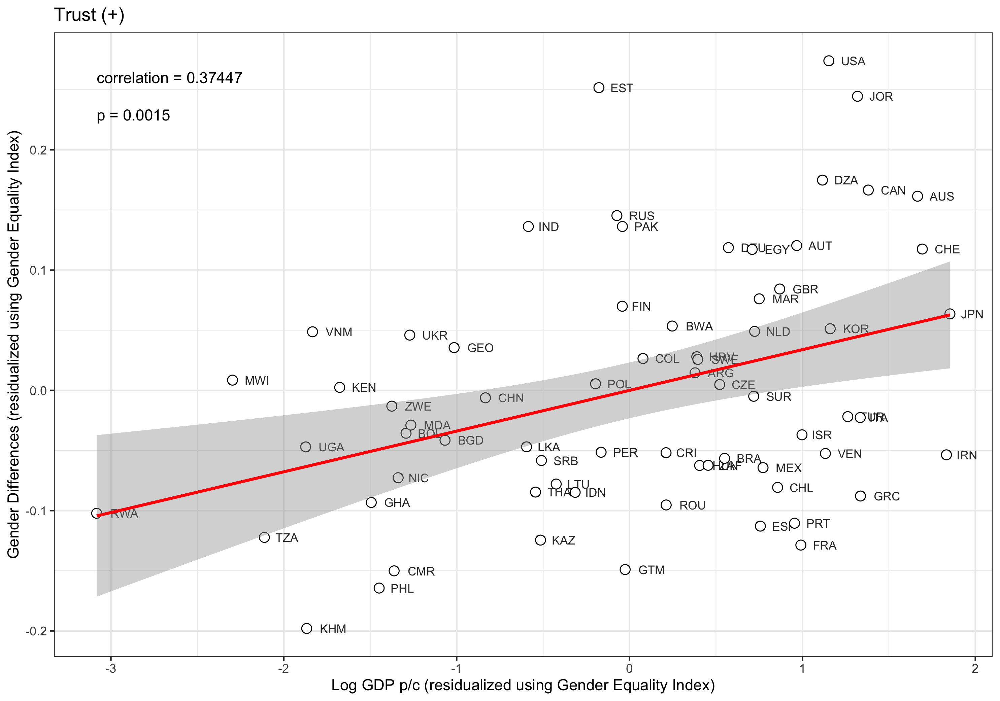 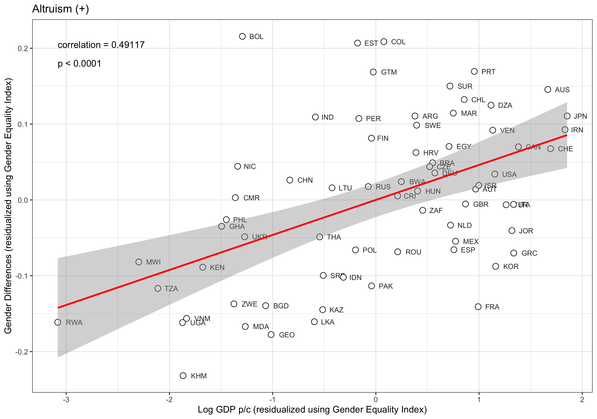

 

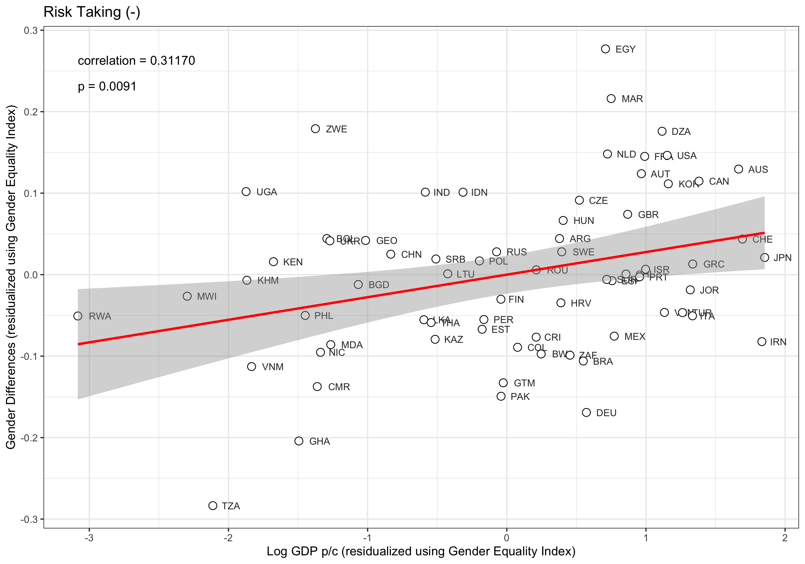 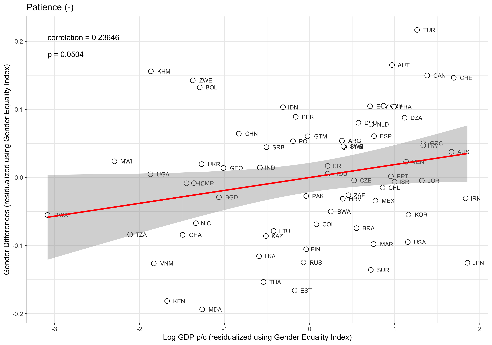

#### Fig. S6. Gender differences and gender equality conditional on economic development by preference and country. 

Each panel shows the relationship between country-level gender differences in a particular preference and the Gender Equality Index, including a linear fit. Gender differences in preferences and the Gender Equality Index were residualized with respect to log GDP p/c. For each preference, the symbols (+)/(-) in the panel titles indicate the general direction of the difference. (+) indicates that women generally exhibited higher levels of the respective preference. (-) indicates that men generally exhibited higher levels of the respective preference. For each preference and country, the gender difference was calculated as the coefficient on a gender indicator with male as the reference category in an OLS regression of the respective preference on the gender indicator, controlling for age, age squared, subjective math skills, education level, household income quintile for the particular country sample.

**WARNING:** These plots are very different from the article's ones. We have written the authors of the article and are waiting for comparison of the methods to obtain them.

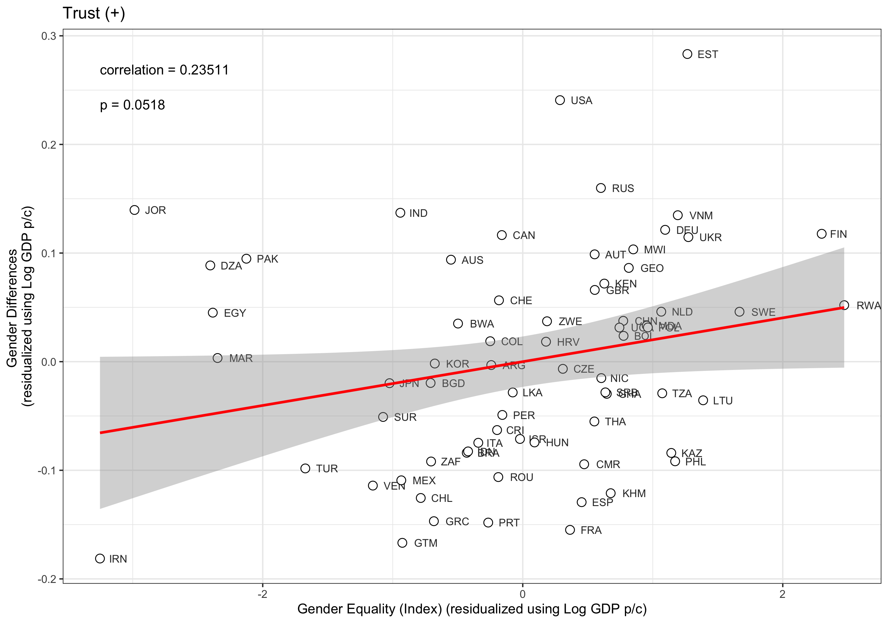 

 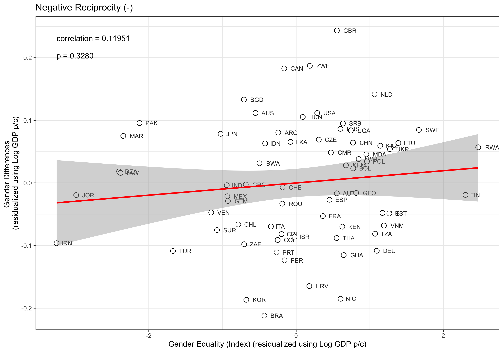

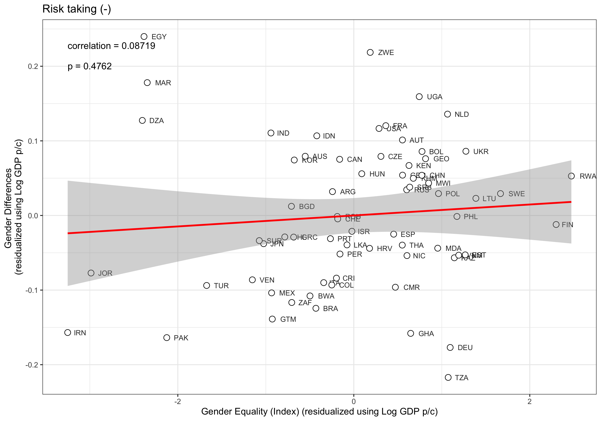 


#### Fig. S8. Gender differences and economic development by preference and country using preferences standardized at the global level. 

Each panel shows the relationship between country-level gender differences in a particular preference and the level of economic development measured by log GDP p/c, including a linear fit. For each preference, the symbols (+)/(-) in the panel titles indicate the direction of the difference. (+) indicates that women exhibited higher levels of the respective preference if the difference was positive. (-) indicates that men exhibited higher levels of the respective preference if the difference was positive. Preference measures were standardized at the global instead of the country level. For each preference and country, the gender difference was then calculated as the coefficient on a gender indicator with male as the reference category in an OLS regression of the respective preference on the gender indicator, controlling for age, age squared, subjective math skills, education level, household income quintile for the particular country sample.

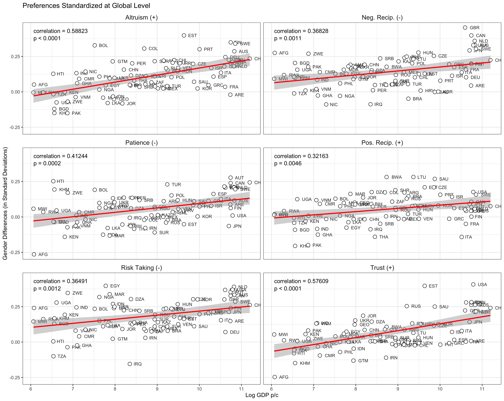

#### Fig. S9. Gender differences and economic development by preference and country without controls. 

Each panel shows the relationship between country-level gender differences in a particular preference and the level of economic development measured by log GDP p/c, including a linear fit. For each preference, the symbols (+)/(-) in the panel titles indicate the direction of the difference. (+) indicates that women exhibited higher levels of the respective preference if the difference was positive. (-) indicates that men exhibited higher levels of the respective preference if the difference was positive. For each preference and country, the gender difference was calculated as the coefficient on a gender indicator with male as the reference category in an OLS regression of the respective preference on the gender indicator without controls for the particular country sample.

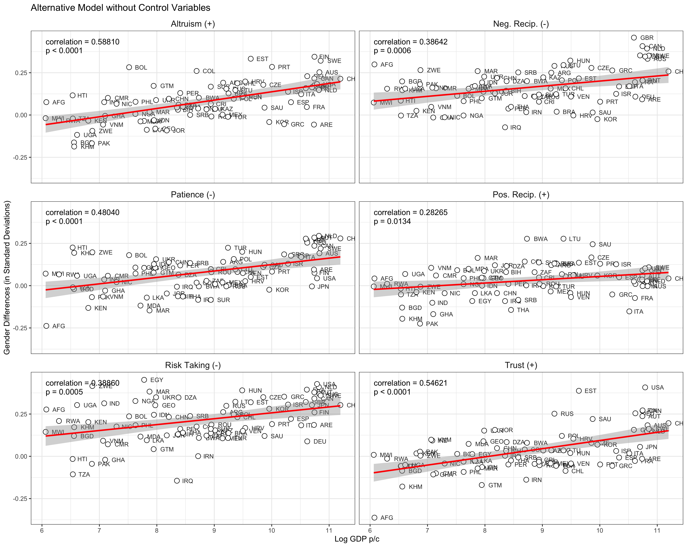

---

## Output of the Analysis

The result of the analysis is written into five csv files (two for the main analysis, three for the supplementary material), and these files can be used to reproduce the plots and for comparison to any other analysis based on this method.

The files are:

<details>
  <summary> main_data_for_histograms.csv </summary>
This file contains the data for reproducing the plot in Fig. 1 (A and C), the distribution of the gender differences within poorer/less gender-equal (corresponding to 1 in the data) and richer/more gender-equal countries (corresponding to 4) among the six preferences. The data consists of 4 variables: preference, GDPquant, GEIquant, meanGenderGDP, meanGenderGEI.
<ul type="square">
  <li> preference is a character and can be one of the 6 economic preferences (patience, risk-taking, altruism, negative and positive reciprocity, and trust). </li>

  <li> GDPquant is a numeric, from 1 to 4, where 1 represents the lowest quantile, meaning the poorest countries of the dataset, and 4 represents the highest quantile, that is the richest countries from the dataset </li>

  <li> GEIquant is a numeric, from 1 to 4, representing the equality of the countries in terms of gender opportunities, where 1 is the lowest quantile (the less gender-equal countries), and 4 is the highest (the more gender-equal) </li>

  <li> meanGenderGDP is the average of the gender difference coefficient by preference by GDP quantile </li>

  <li> meanGenderGEI is the average of the gender difference coefficient by preference by Gender Equality Index quantile </li>
</ul>
</details>

<details>
  <summary> main_data_aggregatedByCountry_preferencePCA_genderIndexPCA.csv  </summary>
Data aggregated by country containing the Average Gender Differences (the first component of the PCA made on the six preferences for the gender coefficient), all the indicators of the economic development and gender equality, plus their Standardization, and the residuals that can be used to build Fig. 2.  The data consists of 27 variables:
<ul type="square">

  <li> country is a character </li>

  <li> avgGenderDiff is numeric and it is the result of the PCA on the gender coefficients at country level </li>

  <li> isocode is a character </li>

  <li> logAvgGDPpc is numeric and it is the logarithm of the average GDP of the country in the period from 2003 to 2012, in 2010 US dollars </li>
  
  <li> Date is a date and corresponds to the time of women’s suffrage </li>

  <li> ScoreWEF is numeric and corresponds to a score extracted from the WEF Gender Equality Index </li>

  <li> avgRatioLabor is numeric and is the average of the labor of females divided by the labor of males in the country (if 1, the working force of the country is equally distributed between females and males) </li>

  <li> ValueUN is numeric and corresponds to a score extracted from the UN Gender Inequality Index </li>

  <li> region is a character and corresponds to the region of the world in which the country belongs </li>

  <li> telephone is logic, and it is TRUE if the survey has been performed by telephone in that country </li>

  <li> personal is logic, and it is TRUE if the survey has been performed face-to-face in that country </li>

  <li> avgGenderDiffRescaled is the same measurement as avgGenderDiff, but rescaled using the min-max method </li>

  <li> GenderIndex is numeric and it is the result of the PCA on the four measurements of Gender Equality Indexes (Date, ScoreWEF, ValueUN, and avgRatioLabor) </li>

  <li> logAvgGDPpcStd same, but standardized </li>

  <li> ScoreWEFStd same, but standardized </li>

  <li> ValueUNStd same, but standardized </li>

  <li> DateStd same, but standardized </li>

  <li> avgRatioLaborStd same, but standardized </li>
  
  <li> GenderIndexStd same, but standardized </li>
  
  <li> GenderIndexRescaled same, but rescaled using a min-max method </li>

  <li> residualslogAvgGDPpcStd is the variable created using the logAvgGDPpcStd residualised using GenderIndexStd </li>

  <li> residualsavgGenderDiffStd_GEI is the variable created from the avgGenderDiffStd residualised using GenderIndexStd </li>

  <li> residualsGenderIndexStd is the variable created from GenderIndexStd residualised using logAvgGDPpcStd </li>

  <li> residualsavgGenderDiffStd_GDP is the variable created from the avgGenderDiffStd residualised using logAvgGDPpcStd </li>

  <li> residualsScoreWEFStd is the variable created from the ScoreWEFStd residualised using logAvgGDPpcStd </li>

  <li> residualsValueUNStd is the variable created from the ValueUNStd residualised using logAvgGDPpcStd </li>

  <li> residualsavgRatioLaborStd is the variable created from the avgRatioLaborStd residualised using logAvgGDPpcStd </li>

  <li> residualsDateStd is the variable created from the DateStd residualised using logAvgGDPpcStd </li>
</ul>
</details>

<details>
  <summary> supplementary_data_aggregatedByCountry_singlePreference_genderCoefficients.csv </summary>

Data aggregated by country but separating each of the six preferences gender difference values. 
<ul type="square">
  <li> country, isocode, logAvgGDPpc, GenderIndex, GenderIndexStd, ScoreWEFStd, ValueUNStd, DateStd, avgRatioLaborStd are the same variables as described above </li>

  <li> gender is the coefficient related to the linear regression on the preference </li>

  <li> preference is the same as described above, and in this dataset we kept the six preferences distinguished and not combined into a PCA </li>
 
  <li> residualsgenderGEI_trust, residualsgenderGEI_altruism, residualsgenderGEI_negrecip, residualsgenderGEI_posrecip, residualsgenderGEI_risktaking, residualsgenderGEI_patience are built performing a linear regression of the gender coefficient of the specific variable and the Gender Equality Index, and then calculating the residuals from it </li>

  <li> residualsgenderGDP_trust, residualsgenderGDP_altruism, residualsgenderGDP_negrecip, residualsgenderGDP_posrecip, residualsgenderGDP_risktaking, residualsgenderGDP_patience are built performing a linear regression of the gender coefficient of the specific variable and the log GDP p/c, and then calculating the residuals from it </li>

  <li> residualslogAvgGDPpc is the variable created from GenderIndex residualised using logAvgGDPpc, and residualsGenderIndex is the variable created from logAvgGDPpc residualised using GenderIndex </li>

</ul>
</details>

<details>
  <summary> supplementary_data_aggregatedByCountry_singlePreference_genderCoefficientsGlobal.csv </summary>

Data aggregated by country, separating each of the single preferences and standardize them at a global level. 
<ul type="square">
  <li> country, isocode, and logAvgGDPpc are the same variables as described above </li>

  <li> gender is the coefficient related to the linear regression on the preference </li>

  <li> preference is the same as described above, except that here we standardize them at a global level </li>
</ul>  
</details>

<details>
  <summary> supplementary_data_aggregatedByCountry_singlePreference_genderCoefficients_alternativeModel.csv </summary>

Data created from the alternative model where only the gender is kept as variable to regress the preference, aggregated by country and including the economic development variable. 
<ul type="square">
  <li> country, isocode, preference, and logAvgGDPpc are the same variables as described above </li>

  <li> gender is the coefficient calculated from the linear regression when using the alternative model without control variables </li>

  <li> preference is the same as described above, and in this dataset we kept the six preferences distinguished and not combined into a PCA </li>
</ul>
</details>


## Comparison of the replication with the original study

To have a feeling about our analysis' results, we wanted to compare the output from our analysis and the main article's one.

Using an online tool for the data extraction (like [this one here](https://automeris.io/WebPlotDigitizer/) for instance), we extracted the average gender differences from the article's plot, in order to compare it with the gender coefficients extracted from our models. 

### The method used

To make this comparison, we used the Bayesian Estimation Supersedes the t-Test as a method for understanding if the resulting distributions were statistically the same.

For a better understanding of the following results, we highly recommend to read [this article](https://rdrr.io/cran/BEST/f/inst/doc/BEST.pdf) or to watch [this video](https://www.youtube.com/watch?v=fhw1j1Ru2i0) to have an idea of the method behind.

We used this method fundamentally for two reasons:

- The usual way to compute a comparison between two datasets, the t-test, requires the data to be normally distributed, which was not our case;

- The BEST method convinced us to be a more reliable method especially because **it can confirm if two distributions are statistically the same**, and thus doing something that the t-test fails. 

For our purpose, it was pretty relevant to have a statistical confirmation that our gender coefficients, extracted from a linear model based on a fewer number of parameters with respect to what the authors claimed to use. As a matter of fact, the GPS dataset included only the gender, age, and subjective math skills as possible variables to put in the model, while the authors used additionally the household income quintile, education level, and country fixed effects. The authors claimed that these additional variables (together with age, age squared, and subjective math skills) were actually only control variables, and for us, that meant we could avoid searching for the extra data because they were not as much relevant.

### Results

One can check the resulting plots looking at the plot:
. 

Here the explanation of the plots and the results from them:

- The first distribution (Group 1 Mean) is the distribution of the gender differences taken from the article. The plot is telling us that the most plausible value for the mean of such distribution (that can be seen in red in the first plot on the right) is 0.458 and that the High-Density Intervals (corresponding to the canonical 95% confidence level) for the mean are between 0.401 and 0.514. 

- The second plot on the left is the same as described above but for the results of our models. On the right, the second plot is showing in red the real distribution of the data and in blue the distribution of the most representative parameters, meaning a mean which most plausible is 0.505 and lying between 0.449 and 0.564.

- The third and fourth plots on the left are the distribution of the most plausible standard deviations for the article (Group 1) and our results (Group 2). 

- The last plot on the left is another parameter describing the t-distribution: The closer to infinity, the more "normal" the distribution is.

What is really interesting to check here are the third and fourth plots on the right: These plots are the difference of the means and the difference of the standard deviations between the two posterior distributions. These plots are telling us that the differences between the mean and the standard deviation of the distributions are lying within the 95% HDI, and thus representing two t-distributions that are not distinguishable and, therefore, statistically the same. 

**What we found with our models doesn't differ statistically to what the authors of the article found using their models.**

Using a more established method, we also plotted the average gender differences from the article with respect to the average gender differences extracted from our model. The result can be seen in the plot:

 

where one can see that the data are correlated at almost 98% with a p-value smaller than 0.0001.


google-site-verification: google99524b02c8de2e63.html
